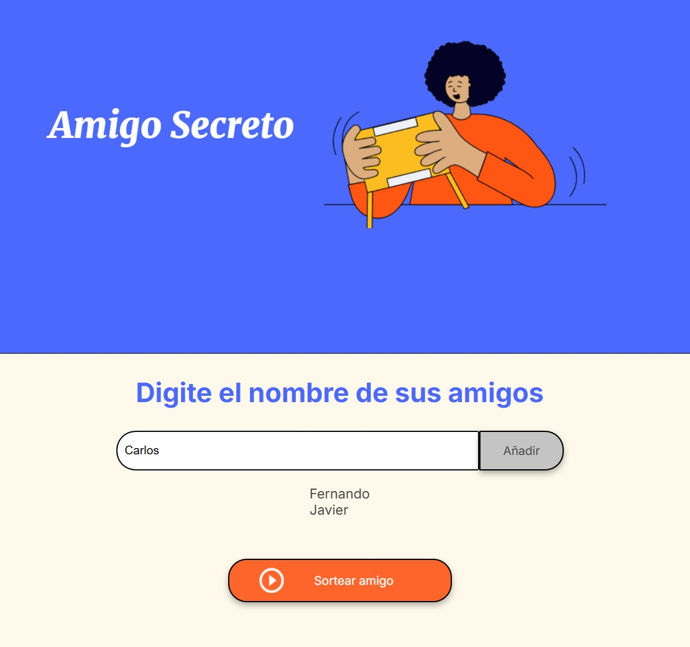

<h1 align="center"> Amigo-Secreto </h1>

El juego de amigo secreto trata de que debes ingresar los nombres de tus amigos e ir agregándolos luego de presionar el botón añadir, notarás como se van agregando en forma de pila. Cuando hayas terminado de agregarlos puedes presionar el botón de Sortear amigo y el juego elegirá de forma aleatoria al ganador. 

## Ejemplo del juego:

Ingresaré el nombre de tres amigos: Fernando, Carlos y Javier, los añadiré 

Seguidamente presionaré el botón de sortear amigo y veremos quien será el ganador... 

¡¡ Fernando es el ganador del sorteo !! 